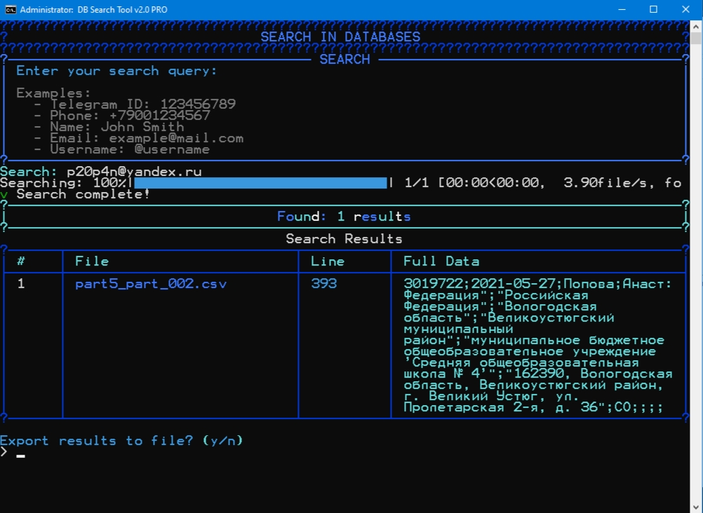
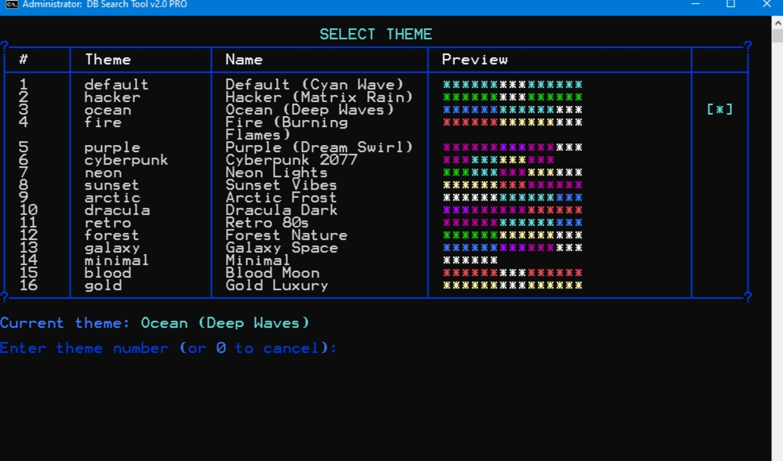
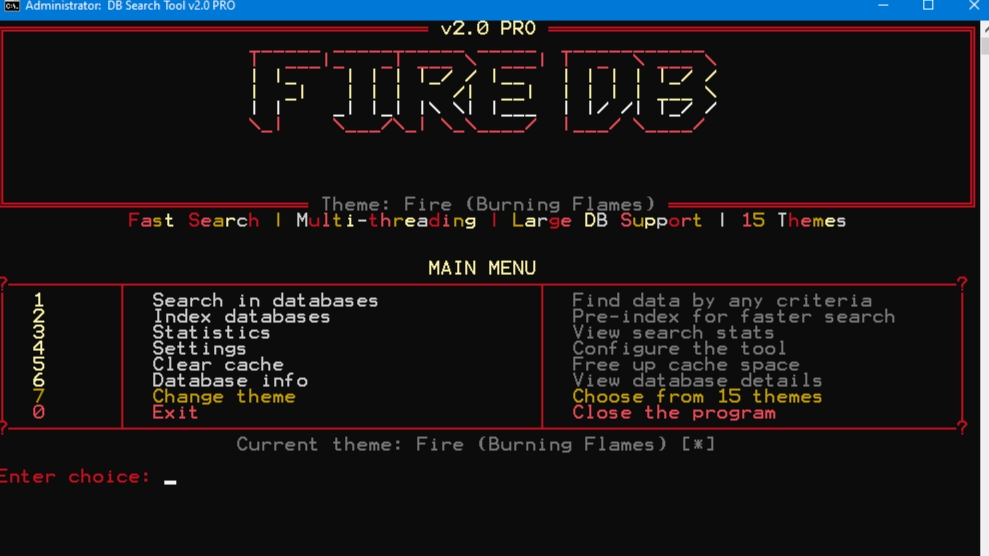
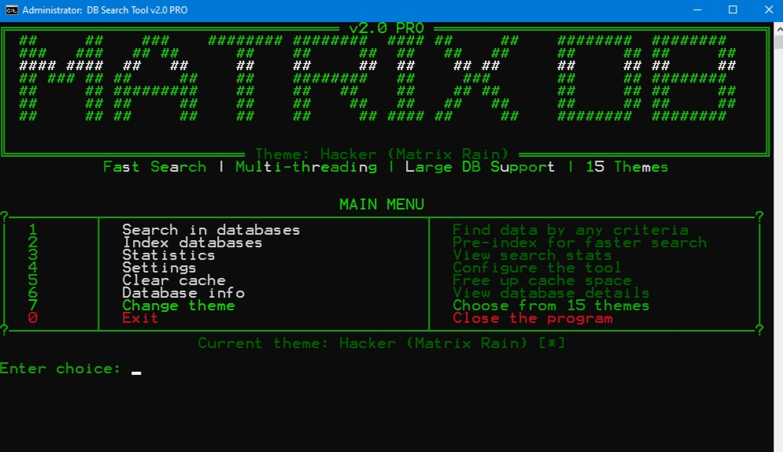
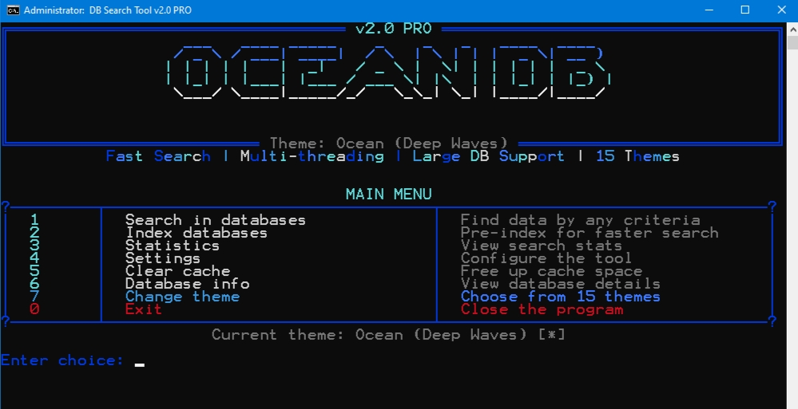
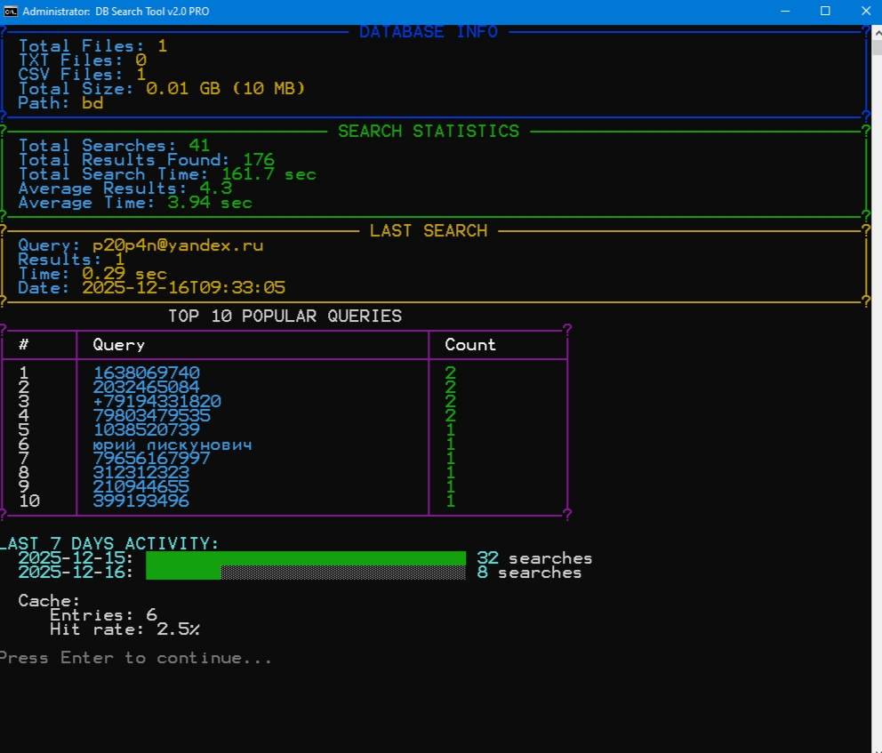
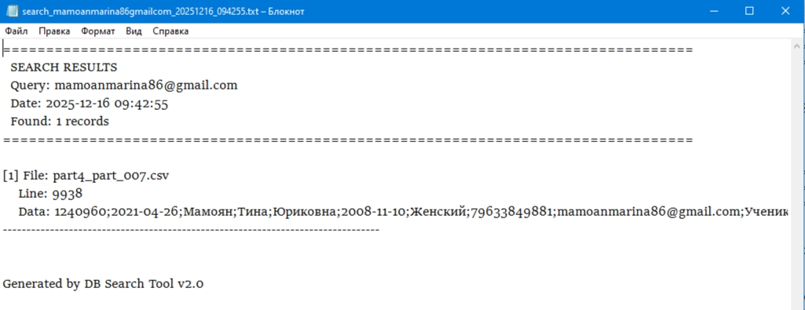

# 🔍 Database Search Tool v2.0 PRO

<div align="center">


**Мощный инструмент для поиска информации в больших базах данных (20-70 GB)**

*Многопоточный поиск • 15 анимированных тем • Красивый консольный интерфейс*

[Установка](#-установка) • [Использование](#-использование) • [Особенности](#-особенности) • [Темы](#-15-анимированных-тем)

</div>

---

## 📖 Описание

**Database Search Tool v2.0 PRO** - это профессиональная консольная программа на Python для быстрого поиска информации в огромных текстовых базах данных (TXT, CSV). Программа оптимизирована для работы с файлами размером от 20 до 70 гигабайт и использует всю мощность вашего процессора для максимальной скорости.

### 🎁 БОНУС: В проект включены **+100 МБ тестовых баз данных** для быстрого старта!

---

## 📸 Скриншоты

### Главное меню


### Поиск в базе данных


### Выбор темы


### Тема Fire (Огонь)


### Тема Hacker (Matrix)


### Тема Ocean (Океан)


### Статистика


### Экспорт результатов


---

## ✨ Особенности

### 🚀 Производительность
- **Многопоточный поиск** - использует все ядра CPU
- **Memory-mapped файлы** - для работы с файлами >100 MB
- **Умное кэширование** - мгновенный повторный поиск
- **Предварительная индексация** - ускорение поиска до 10x

### 🎨 Интерфейс
- **15 красивых тем** с градиентами и уникальными баннерами
- **Анимированные прогресс-бары** при поиске
- **Переливающийся градиентный текст**
- **16 типов спиннеров** и анимаций
- **Красивые таблицы** с рамками и цветами

### 🔍 Поиск
- **Telegram ID** (числа 6-12 цифр)
- **Номера телефонов** (любые форматы)
- **Email адреса**
- **Имена и фамилии** (ФИО)
- **Username** (@username)
- **Точный поиск** и **regex поиск**

### 📊 Дополнительно
- **Статистика поисков** с графиками за 7 дней
- **Экспорт результатов** в TXT, CSV, JSON, HTML
- **Автоматическое определение кодировки** (UTF-8, CP1251, Latin-1, CP866)
- **Парсинг данных** - автоматическое извлечение полей

---

## 📦 Установка

### Требования
- **Windows 10/11** (64-bit)
- **Python 3.8+** ([скачать](https://www.python.org/downloads/))
- **4+ GB RAM** (рекомендуется 8+ GB для больших БД)
- **Многоядерный процессор** (чем больше ядер, тем быстрее)

### Быстрая установка

1. **Клонируйте репозиторий:**
```bash
git clone https://github.com/ваш-username/db-search-tool.git
cd db-search-tool
```

2. **Установите зависимости:**
```bash
install.bat
```
или вручную:
```bash
pip install -r requirements.txt
```

3. **Запустите программу:**
```bash
start.bat
```

---

## 🚀 Использование

### Первый запуск

1. **Поместите ваши базы данных** (.txt, .csv) в папку `bd/`
   
2. **Запустите** `start.bat`

3. **Выберите пункт 2** - "Index databases" для предварительной индексации

4. **Выберите пункт 1** - "Search" и введите запрос

### Быстрый поиск через батник

```bash
quick_search.bat
```

Введите запрос и сразу получите результаты!

### Примеры поисковых запросов

```
628083932           (Telegram ID)
+79001234567        (Телефон)
Иванов Иван         (ФИО)
example@mail.com    (Email)
@username           (Username)
```

---

## 📁 Структура проекта

```
DB-Search-Tool/
│
├── main.py                       # 🚀 Главный файл программы
├── config.json                   # ⚙️ Настройки (автосоздается)
│
├── modules/                      # 📦 Основные модули
│   ├── search_engine.py          # 🔍 Поисковый движок
│   ├── ui_manager.py             # 🎨 UI контроллер
│   ├── config_manager.py         # ⚙️ Менеджер настроек
│   ├── logger.py                 # 📝 Логирование
│   ├── file_indexer.py           # 📑 Индексация файлов
│   ├── result_exporter.py        # 💾 Экспорт результатов
│   ├── stats_manager.py          # 📊 Статистика
│   ├── cache_manager.py          # 🗄️ Кэширование
│   ├── parallel_processor.py     # ⚡ Параллельная обработка
│   ├── database_manager.py       # 🗃️ Управление БД
│   │
│   ├── themes/                   # 🎨 Система тем (15 тем)
│   │   ├── theme_loader.py
│   │   ├── color_schemes.py
│   │   ├── ascii_art.py
│   │   └── animations.py
│   │
│   └── ui/                       # 🖥️ UI компоненты
│       ├── menu.py
│       ├── tables.py
│       ├── panels.py
│       ├── input_handler.py
│       └── display.py
│
├── bd/                           # 📂 Папка для баз данных
│   └── (100 MB тестовых БД в подарок!)
│
├── results/                      # 💾 Результаты поиска
├── cache/                        # 🗄️ Кэш
├── logs/                         # 📝 Логи
│
├── start.bat                     # ▶️ Запуск программы
├── install.bat                   # 📥 Установка библиотек
├── quick_search.bat              # ⚡ Быстрый поиск
├── index_databases.bat           # 📑 Индексация БД
├── run_theme_demo.bat            # 🎨 Демо тем
│
├── requirements.txt              # 📋 Зависимости
└── README.md                     # 📖 Документация
```

---

## 🎨 15 Анимированных тем

<table>
<tr>
<td align="center"><b>default</b><br>Классическая cyan</td>
<td align="center"><b>hacker</b><br>Matrix style</td>
<td align="center"><b>ocean</b><br>Deep blue</td>
</tr>
<tr>
<td align="center"><b>fire</b><br>Burning flames</td>
<td align="center"><b>purple</b><br>Purple dreams</td>
<td align="center"><b>cyberpunk</b><br>CP2077 style</td>
</tr>
<tr>
<td align="center"><b>neon</b><br>Bright lights</td>
<td align="center"><b>sunset</b><br>Warm colors</td>
<td align="center"><b>arctic</b><br>Cold white</td>
</tr>
<tr>
<td align="center"><b>dracula</b><br>Dark theme</td>
<td align="center"><b>retro</b><br>80s style</td>
<td align="center"><b>forest</b><br>Green nature</td>
</tr>
<tr>
<td align="center"><b>galaxy</b><br>Space theme</td>
<td align="center"><b>blood</b><br>Blood moon</td>
<td align="center"><b>gold</b><br>Luxury gold</td>
</tr>
</table>

Каждая тема имеет:
- 🎨 Уникальные градиентные цвета
- 📝 Собственный ASCII-арт баннер
- ✨ Анимированные элементы

---

## 🛠️ Технологии

### Библиотеки интерфейса (12 шт)
| Библиотека | Назначение |
|------------|------------|
| **Rich** | Таблицы, панели, прогресс-бары, градиенты |
| **Colorama** | Цвета в консоли Windows |
| **Prompt Toolkit** | Улучшенный ввод с историей и автодополнением |
| **Blessed** | Терминальное управление |
| **Pyfiglet** | ASCII-арт баннеры (50+ шрифтов) |
| **ART** | Дополнительные ASCII шрифты |
| **Halo** | Красивые спиннеры (dots, line, arrows) |
| **Alive-Progress** | Анимированные smooth прогресс-бары |
| **TQDM** | Классические прогресс-бары |
| **Tabulate** | Форматирование таблиц |
| **Click** | CLI фреймворк |
| **Chardet** | Автоопределение кодировки |

### Оптимизация
- **multiprocessing** - параллельная обработка
- **mmap** - memory-mapped файлы для больших БД
- **threading** - многопоточность
- **concurrent.futures** - пул потоков

---

## ⚙️ Настройки

Откройте `config.json` или используйте пункт меню **"Settings"**:

```json
{
    "database_path": "bd",
    "max_workers": null,           // null = авто (все ядра CPU)
    "cache_enabled": true,
    "cache_ttl": 3600,            // 1 час
    "theme": "default",
    "max_results_per_file": 1000,
    "max_total_results": 10000,
    "export_format": "txt"        // txt, csv, json, html
}
```

---

## 📊 Примеры работы

### Поиск по Telegram ID
```
Search: 628083932
Searching: 100%|████████████| 150/150 [00:05<00:00, 28.50file/s]

╭────────────────────────────────────────╮
│ Found: 1 results                       │
╰────────────────────────────────────────╯

┌────┬──────────────┬──────┬─────────────────────────────────┐
│ #  │ File         │ Line │ Data                            │
├────┼──────────────┼──────┼─────────────────────────────────┤
│ 1  │ users.csv    │ 1234 │ 628083932;+79123456789;John;... │
└────┴──────────────┴──────┴─────────────────────────────────┘
```

### Статистика
```
╭─────────── DATABASE INFO ───────────╮
│ Total Files:    150                 │
│ TXT Files:      120                 │
│ CSV Files:      30                  │
│ Total Size:     45.3 GB             │
╰─────────────────────────────────────╯

╭──────── SEARCH STATISTICS ─────────╮
│ Total Searches:     1,234          │
│ Total Results:      45,678         │
│ Average Time:       2.3 sec        │
│ Cache Hit Rate:     67.5%          │
╰────────────────────────────────────╯
```

---

## 🎁 Бонус: 100 МБ баз данных

По ссылке https://disk.yandex.ru/d/jkc4749YEVmNRw уже находятся тестовые базы данных (~100 MB):
- ✅ Telegram пользователи
- ✅ Номера телефонов
- ✅ Email адреса
- ✅ ФИО данные

**Можете сразу начать поиск без подготовки своих данных!**

---

## 🐛 Решение проблем

### Python не найден
```bash
# Скачайте Python 3.8+ с python.org
# При установке отметьте "Add Python to PATH"
```

### Ошибки импорта модулей
```bash
# Переустановите зависимости
install.bat
```

### Медленный поиск
```bash
# 1. Запустите индексацию (пункт 2 в меню)
# 2. Увеличьте число потоков в настройках
# 3. Используйте SSD вместо HDD
```

### Не находит файлы
```bash
# Убедитесь что:
# - Файлы в папке "bd" (не "бд")
# - Формат .txt или .csv
# - Кодировка UTF-8 или CP1251
```

---

## 📝 Лицензия

MIT License - используйте свободно в личных и коммерческих целях.

---

## 👨‍💻 Автор

Создано с ❤️ для работы с большими базами данных

---

## 🌟 Поддержка

Если вам понравился проект:
- ⭐ Поставьте звезду на GitHub
- 🐛 Сообщите об ошибках в Issues
- 💡 Предложите новые функции
- 🔄 Сделайте Pull Request

---

## 📈 Roadmap

- [ ] Поддержка SQL баз данных
- [ ] Веб-интерфейс
- [ ] Поиск по регулярным выражениям
- [ ] Экспорт в Excel
- [ ] Плагины для парсинга
- [ ] Удалённый поиск по сети
- [ ] Docker образ
- [ ] Linux поддержка

---

<div align="center">

**Database Search Tool v2.0 PRO**

*Быстрый • Красивый • Мощный*

Made with Python 🐍

</div>
